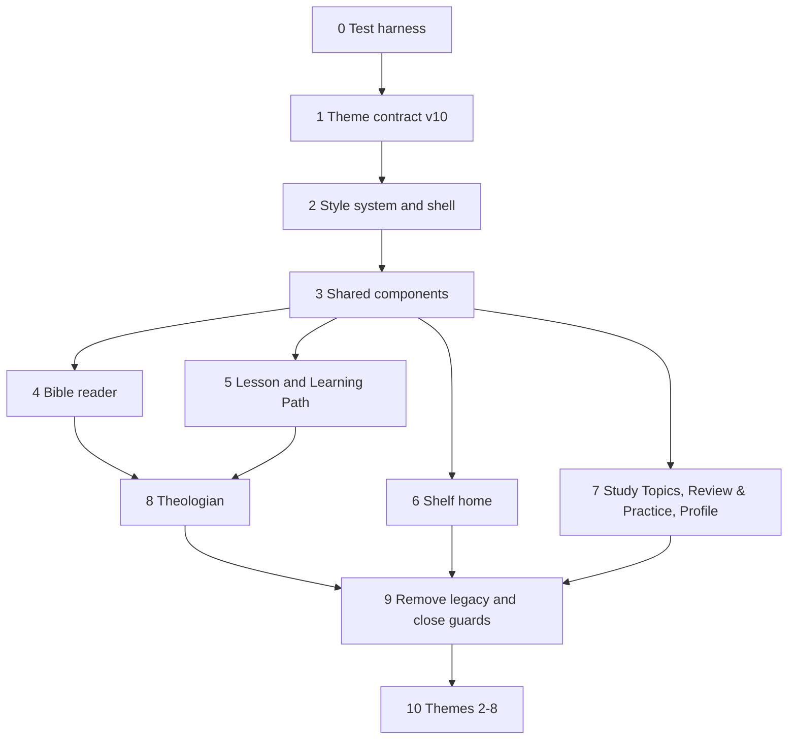

# Redesign implementation plan — 2026-10-03

This plan supersedes the slice list in `PLAN_STRUCTURAL_REDESIGN_2026-10-03.md` as the build plan. That document still holds the scope, preservation rules and vocabulary.

- **Visual reference:** `docs/v7/mockups-2026-10-03/` (`redesign.mockups.confirmed`).
- **Rule for this plan:** build the design system the mockups describe, then move screens onto it. No override layers, no patching old markup to look new, no `!important`, no aliases. Old code is deleted once its replacement passes, not left running underneath.

**No phase starts until Chris approves this graph** (`redesign.implementation.plan`).

## Why the current front end can't simply be restyled

The current front end can't reach the mockups by restyling, for four measured reasons.

1. **Layered stylesheets.**
   - `index.html` loads 12 stylesheets (about 186 KB). `canonical-shelf.css` (46 KB) loads last and exists mostly to override the files before it.
   - Every change today is one more override on top. That is how the 192 hard-coded colors, 36 `!important`s and 25 literal z-indexes in `.roa/guard-baseline.json` built up.
2. **Markup scattered across feature scripts.**
   - The shell (masthead and nav), cards, tabs and panels are re-implemented in `topbar.js`, `app.js`, `bible.js`, `learning.js`, `course-experience.js`, `topics-experience.js`, `practice-experience.js` and `theologian-chat.js`, each with its own markup and class names.
   - The same component looks different on different screens, which is why the mockups currently need many one-off fixes.
3. **Thin theme contract.**
   - The contract has 14 color roles. The mockups need roles it doesn't have: Scripture bed, selection, highlight colors, note marker, chat surface, edge-tab colors, and per-theme group colors.
   - Without those roles, screens fall back to raw colors.
4. **Weak test coverage of the interface.**
   - Browser tests cover the product contract, the theme contract, and Theologian offline and scroll behavior only.
   - Nothing checks layout, phone width, no-scroll lessons, contrast, or that labels use the decided vocabulary.

## Target architecture

### Styles

The 12 sheets are replaced by one cascade-layered system:

```
@layer tokens, reset, base, layout, components, screens, utilities;
```

| Layer | File(s) | Holds |
|---|---|---|
| tokens | `theme.css` (generated) | Every role, spacing, radius, shadow, type, layer and group-color variable. Nothing else. |
| reset / base | `ui/base.css` | Element defaults from roles: body, headings, links, focus ring, form controls. |
| layout | `ui/layout.css` | App shell, frame, three-pane grid (links, content, panel), phone card frame, edge-tab dock. |
| components | `ui/components/*.css` | One file per component listed below. |
| screens | `ui/screens/*.css` | Screen-specific arrangement only. No colors, no component restyling. |
| utilities | `ui/utilities.css` | Visually hidden, truncation, and similar small helpers. |

Layer rules, enforced by the guard:

- Colors appear only in `theme.css`. Everything else uses role variables.
- Stacking uses the `--layer-*` variables only: nav, edge tabs, popups, dim overlay, Theologian.
- `!important` and literal z-index values are forbidden.
- The screens layer may not set colors, fonts or radii.

### Components

There is one implementation per component: a small render function in `public/ui/components/` plus one CSS file. Every screen uses these and does not build its own markup.

| Component | Used by |
|---|---|
| AppShell (nav with fixed brand slot, all-caps underlined nav, Feedback, profile) | every screen |
| Frame (desktop page frame; phone card with 10px margins) | every screen |
| Rail / RailLink (left links: groups, counts, current item) | reader, lesson, Learning Path, Study Topics, Review & Practice |
| Panel / Card (raised surfaces, two shadow levels) | everywhere |
| EdgeTab (Theologian, My Notes; chevron, fixed position, open state hides tab) | every screen |
| ScriptureBlock (group-color bar, reading serif, chip caption) | lessons, Study Topics, Theologian |
| ScriptureRef (address link with group bar; expandable verse text) | cross-references, Theologian sources |
| GroupChip (shelf-group color plus name) | reader, Shelf panel, lessons |
| VerseText (selectable verses, word-level highlights, note underline, footnote badges) | reader, phone reader |
| VerseActions (highlight colors plus "+ Note" popup) | reader |
| Footnote (badge plus floating card plus chapter-end list) | phone reader, phone lesson |
| NotesPanel ("My notes on…", add a note) | reader, lesson |
| ProgressBar / ProgressScope (labelled Unit, Module, Path) | Learning Path, lessons |
| StepList / StepStrip (desktop list, phone strip) | lesson |
| LessonWindow (title-bar breadcrumb, Back/Continue, one screen per step part) | lesson |
| TheologianPanel (docked desktop, centered phone, dim overlay, Scripture cited, suggestions, composer) | every screen |
| Bookshelf (wall shelves, verse-count widths, fills, lean, hover names) | Shelf home |
| GameTile (visual tile per game type) | Review & Practice |

### Labels and routes

- **Labels:** `public/ui/labels.js` is the single source of truth for every learner-facing name: Learning Path, Module, Unit, Lesson, Capstone, Study Topics, Review & Practice, My Notes, and the nav labels. Screens import names from it, and a test fails on stray "course," "volume," "Catalog," or "Notes" used as a section name.
- **Routes:** canonical URLs and content IDs stay as they are. The aliases `/path`, `/study-topics` and `/review` are added in both the router and the Worker fallback.

### Content

Untouched. Lesson text, Scripture, answer logic and completion rules are read through the existing loaders, and screens change only how they present them (`curriculum.rewrite.preservation`).

## Phases

Each phase ships as its own PR. Each PR must pass:

- `bun run verify`, with no change to the BSB, contract, assessment, sync, D1, feedback and Theologian suites.
- `roa verify`.
- The guard baseline shrinking, never growing.
- The phase's own checks, listed with it below.



### 0 — Test harness (first, so every later phase is measured)

- Browser tests at 390×844 and 1440×900 for each route: Shelf, reader, lesson, Learning Path, Study Topics, Review & Practice.
- Checks for:
  - no horizontal scroll on phones
  - no scrolling on any lesson screen at the default text size
  - nav items in the same position on every route
  - Theologian tab position identical on every phone route
  - WCAG AA contrast for text roles in every theme and mode
  - vocabulary
- Screenshot baselines are captured from the current build and then replaced phase by phase with the mockup-matching build.

**Exit:** the suite runs in `bun run verify` and reports the current failures as the to-do list.

### 1 — Theme contract v10

- Add roles to `.roa/contracts/theme`:
  - `scriptureBed`, `selection`, `noteMarker`
  - `highlight.{yellow,green,blue,rose}`
  - `chatSurface`, `chatUser`
  - `edgeTheologian`, `edgeNotes`
  - `dimOverlay`
  - `shadowCard`, `shadowFrame`
  - the corner scale (`radius.chip/control/card/frame`)
  - `layer.*`
- Move the nine group colors from `shared` into each theme and mode (`design.categories.per-theme`), keeping each group's color family.
- Fill every role for Reading Room light and dark from the mockups and `ThemeSheet.dc.html` (the role names on the sheet are the contract names). The other seven themes get temporary values copied from Reading Room until phase 10.
- Contract rules: every role defined in every theme and mode, and text-on-surface combinations at AA contrast.

**Exit:** `roa verify` passes, and `theme.css` contains every value the mockups use.

### 2 — Style system and app shell

- Create the layer stack and `ui/base.css` and `ui/layout.css`.
- Build AppShell and Frame and mount them for every route from `bootstrap.js`.
- Remove `topbar.js` and the masthead and `.primary` rules once the new shell renders on every route.
- Add the labels module and route aliases.

**Exit:** nav and frame match the mockups on all routes, and the nav-position test passes.

### 3 — Shared components

- Build the components in the table above, each with a component test page (`/ui/lab`) showing every state in Reading Room light and dark.
- This replaces the ad-hoc `theme-lab` pages.

**Exit:** every component matches its mockup states, and the lab page passes contrast.

### 4 — Bible reader

- Rebuild the reader from Rail, VerseText, VerseActions, NotesPanel, ScriptureRef, GroupChip and Frame:
  - desktop: three columns
  - phone: card frame, study-link icon row, footnotes, verse popup, edge tabs
- Preserve the `book`, `chapter`, `start`, `end` and `focus` parameters.
- Delete the reader markup and styles in `bible.js`, `bible.css` and `bible-state.css` once replaced.

**Exit:** check `r2-unaided-flow`, the phone checks, and Scripture integrity (`verify:bsb`) all pass.

### 5 — Lesson and Learning Path

- **Lesson:**
  - The window has the breadcrumb title bar, steps and study tools on the left, and content plus notes on the right.
  - Phone: step strip and edge tabs.
  - Each step is split into screens so none scrolls, with "Step N of M · part X of Y."
  - Content redistribution is checked by a word-for-word diff against the source lesson.
- **Learning Path:** path, module and unit on one page.
- Replace `learning.js`, `course-experience.js` and their CSS.

**Exit:** the no-scroll check passes on every lesson screen, the content diff shows nothing lost or changed, every activity ID still completes, and the assessment tests are unchanged.

### 6 — Shelf home

- Bookshelf component: verse-count widths, OT fill, NT at 80%, Revelation lean, walnut planks and supports, iron bookends.
- The two-line v1 title with the intro beside it.
- The selected-book panel uses the real book profiles.

**Exit:** the visual baseline matches the mockup, and keyboard focus shows book names.

### 7 — Study Topics, Review & Practice, Profile

- Rebuild these on Rail and Panel.
- Practice tiles use GameTile. Review progress and practice progress are kept separate.
- Profile sections: My Notes, Saved Passages, Learning Progress, Preferences.

**Exit:** every existing practice mode and parameter still resolves, and check `r3-no-dead-ends` passes.

### 8 — Theologian

- TheologianPanel:
  - desktop docked in the right column; phone centered
  - dim overlay that closes on click
  - no tab while open
  - one interface font
  - Scripture cited section, open by default
  - suggested replies inside the conversation
  - removable passage chip and bordered composer
- Rewire `theologian-chat.js` onto it, keeping the engine, policies and crisis paths unchanged.

**Exit:** `test:theologian` and the offline and scroll specs pass, the tab position is identical on every route, and keyboard focus is trapped while the panel is open.

### 9 — Remove legacy and close the guards

- Delete every stylesheet and render path the new system replaced.
- Measure unused CSS with Playwright coverage and delete what no route uses.
- The guard baseline reaches zero for `css-raw-color`, `css-important` and `css-z-index-literal`. The four `js-head-inject` cases move into the shell.

**Exit:** the guard baseline is empty, and `index.html` loads `theme.css` plus the layered bundle only.

### 10 — Themes 2–8

- Set each remaining theme's role values and group-color family per `design.themes.*` and the `visual-direction` decision.
- Screenshot every route in each theme and mode.

**Exit:** contrast passes for all 16 theme and mode combinations, and layout is identical across themes.

## Where this runs

The work spans the whole front end and needs a full local environment: bun, Playwright browsers, the dev server, and the ability to open PRs. It should run in Claude Code against the repository, one phase per PR, with this plan and the mockups as its brief. This chat environment can't push or run the browser suite end to end.

## Still to settle (does not block phases 0–9)

- `visual-direction`: needed by phase 10.
