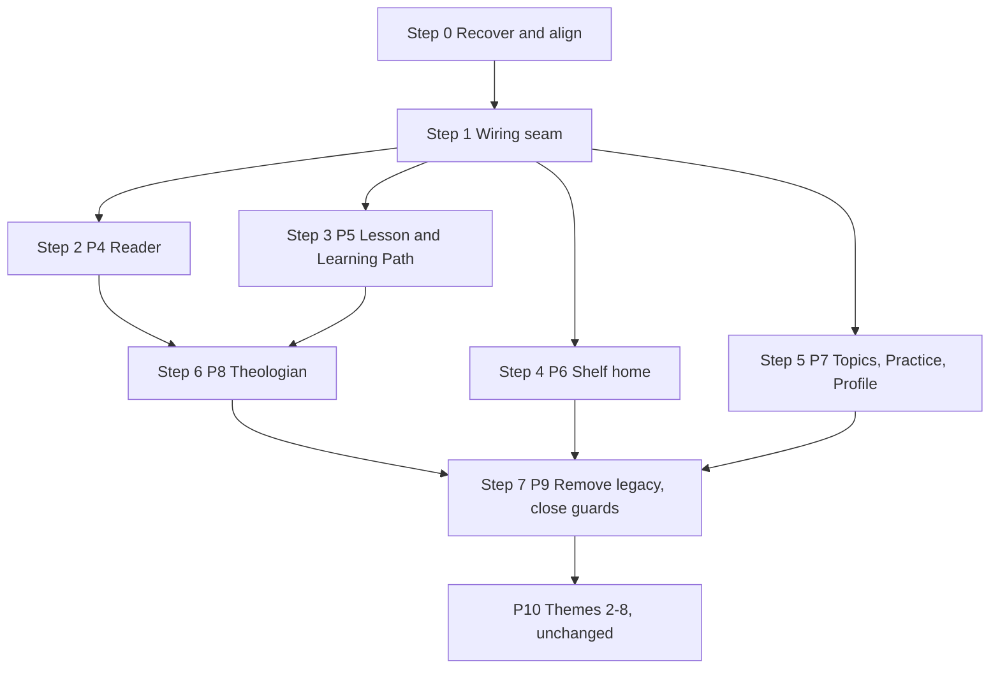

# Redesign implementation plan, amendment — 2026-10-04

This amends `docs/v7/PLAN_IMPLEMENTATION_2026-10-03.md`. That plan still governs: its target architecture, component list, phase content, exit checks, and the rule of one phase per PR with no merge without Chris's approval. This amendment changes four things:

- It records how the work is actually split across branches.
- It records the decisions Chris made on 2026-10-04.
- It adds a recovery step and a wiring step before phases 4–7.
- It replaces the strict phase order for phases 4–9 with a parallel schedule.

**Nothing in this amendment executes until Chris approves it.**

## 1. Where the work stands

| Item | Local (`C:\dev\canonical-shelf`) | GitHub |
|---|---|---|
| `main` | out of date | `a30fb6c`: four commits (#47–#50, the Theologian conversation and secret wiring) that the redesign branches don't contain |
| Plan and decision commits | in the P0 branch history (31 commits ahead of `main`) | only on the P0 and P1 branches |
| `a1969c0` (Module 1 renamed, Checkpoint named, theme sheet added, intro kept) | only in the bundle file `canonical-shelf-redesign-2026-10-03.bundle` | carried onto `feature/redesign-p3a-decisions` (Step 0) |
| P0 test harness | `feature/redesign-p0-test-harness` @ `37a4392` | pushed, no PR |
| P1 theme contract v10 | `feature/redesign-p1-theme-contract-v10` @ `3988d5d` | pushed, no PR |
| P2 style system and shell | `feature/redesign-p2-style-shell` @ `d5ab427` | **local only** |
| P3 shared components | `feature/redesign-p3-shared-components` @ `e3532f0` | **local only** |
| P4 branch (worktree `redesign_implementation_dag`) | same commit as P3, no commits of its own | not pushed |
| Output of the Antigravity multi-agent run | 11 files in `public/ui/screens/`, never committed, never loaded by `app.js` | none |

### What the Antigravity output is worth

Treat it as reference material only. It breaks this plan's own rules in several places:

- `reader.js` hard-codes section headings for Genesis 1, Genesis 2 and John 3 only, so that those chapters match the mockup.
- There are six raw corner radii (one of them `0`) and an inline `text-transform: uppercase` outside the nav.
- The reader builds its own edge tabs instead of using `EdgeTab`. The shelf builds its own group chip instead of using `GroupChip`.
- `reader.js` re-exports `BOOKS`, `GROUPS` and `parseCorpus` instead of moving them into a shared module.
- `lesson.js` doesn't exist. The shared-module extraction (M0) never happened.

Usable pieces, to read before writing the matching screen:

| File | Worth reusing |
|---|---|
| `practice.js` | its wiring to `practice-engine.js`, `practice-state.js` and `verse-data.js` |
| `learning-path.js` | how it reads progress from `db.js`, and its unit and lesson status logic |
| `profile.js` | the form field set (name, email, saved passages, custom translation JSON) |
| `shelf-home.js` | the selected-book aside markup |
| `topics.js` | the three-pane markup (replace its hard-coded category counts with counts from the catalog) |

## 2. Decisions made 2026-10-04

Record these with the kit before Step 2 starts. Each record is a JSON file in `.roa/records/`, named `<UTC timestamp>-000-decision-<id>.json`, in the existing record format (`type`, `kind`, `id`, `topic`, `date`, `text`, `by`). Run `node .roa-kit/roa.mjs sync` after adding them.

| id | kind / by | text |
|---|---|---|
| `ui.naming.unit-check.checkpoint.v2` | decision / Chris | The per-unit scored check is named **Checkpoint** ("Unit 2 Checkpoint"): checkpoints along the Learning Path, a Capstone at the end. Confirms the earlier `ui.naming.unit-check.checkpoint` default as an owner decision. |
| `ui.naming.groups.v1` | decision / Chris | The nine group names everywhere are Law, History, Wisdom and Poetry, Major Prophets, Minor Prophets, Gospels and Acts, Paul's Letters, General Letters, and Revelation. The ninth stays **Revelation**, because "Prophecy" would also cover the Prophets. "Epistle" is taught in Module 1 where the groups are introduced. |
| `ui.bible.phone.board.v1` | default / Claude | The phone Bible reader is built from `PhoneReader.dc.html`, with My Notes and Theologian as stacked right-edge tabs at 298px and 168px from the bottom (`ui.phone.my-notes.side`, `ui.phone.theologian-position.v2`). The "PhoneReaderB" board on the live canvas is a superseded draft. |

Already decided in `a1969c0`, so no new records are needed: the Module 1 title (`curriculum.module1.title.v2`) and keeping the current Shelf intro (`ui.shelf.intro.current`).

Changes that follow, all made on `feature/redesign-p3a-decisions`:

- `public/ui/labels.js` gains `GROUP_NAMES`, now the single source for group names. `library-data.js`, `practice-data.js` and `ui/components/group-chip.js` read from it, replacing three conflicting name sets ("Pauline Epistles", "Prophecy", "Historical Books", "Revelation & Apocalyptic", and others).
- Module 1 lesson `shelf-skills`: the sentence naming the nine groups now uses the decided names. The ledger carries the old wording as `superseded:ui.naming.groups.v1`.
- Module 1 lesson `c1-library-groups`: **Epistle** is added to the glossary, using the same definition as Module 3. This adds content and removes none.
- Mockups already say "Checkpoint", so they need no change. Screens read the label from `labels.js` (add `unitCheck: 'Checkpoint'` in Step 1).

## 3. Build sequence

The critical path is **Step 3 → Step 6 → Step 7**. Steps 2, 4 and 5 run in parallel beside it. Each step is a branch and a PR, built in Claude Code against the repo, with this amendment, the original plan and `docs/v7/mockups-2026-10-03/` as the brief.

### Step 0 — Recover and align (done in the cloud, applied from a bundle)

The P0–P3 stack has already been rebased onto `main` (`a30fb6c`), with every conflict confined to generated files and regenerated by `roa sync`. On top sits `feature/redesign-p3a-decisions`, which holds:

- the bundle commit
- the Section 2 records and follow-up changes
- this amendment

All of it is verified on the tip of `p3a`:

- `build:app`, `verify:bsb`, `verify:contract`, `verify:sw`, `test:core`
- the browser suite: 106 of 106 pass
- `roa verify`

Chris applies it by fetching `canonical-shelf-step0-2026-10-04.bundle` and force-pushing the five branches, then opens five stacked draft PRs: P0 into `main`, P1 into P0, P2 into P1, P3 into P2, and P3a into P3.

**Exit:** the five branches are on GitHub and match the bundle. The `redesign_implementation_dag` worktree has been removed.

### Step 1 — Wiring seam

Branch `feature/redesign-p3b-screen-seam`, off P3a. One small PR that every screen PR builds on, so the four screen branches never edit the same lines.

- **Screen registry in `app.js`.** For each route, mount the new screen module when it exists and fall back to the current view when it doesn't. Each screen PR adds exactly one registry entry and removes its fallback in the same PR.
- **One screen contract:**
  - `mount(container, ctx)` returns a cleanup function, where `ctx = { params, data, corpus, state, db, esc, labels }`.
  - Screens never fetch the catalog or the corpus themselves.
- **Stylesheet slots in `index.html`.** Add one `<link>` per screen stylesheet, after the component sheets. Each points to a file that exists in this PR as a layered stub (an empty `@layer screens {}`), so later PRs only fill files in.
- **Shared modules:**
  - Move `BOOKS`, `GROUPS`, `parseCorpus` and `parseReference` into `public/bible-books.js`, and point `theologian.js`, `search-engine.js`, `search-experience.js` and `study-index.js` at it.
  - Move `challengeEvaluationMode`, `challengeFor`, `challengeCountFor` and `checkChallenge` into `public/challenge-engine.js`. Point `scripts/test-assessment.mjs` and `app.js` at it, and keep a re-export in `learning.js` until Step 3 deletes that file.
- **ROA registration:** add every new `public/` file to the ROA manifest.
- **New theme tokens:**
  - Walnut and iron tokens for the shelf, from `Main.dc.html`, added to `.roa/values/theme.json` and regenerated.
  - Radius tokens `--radius-bar` (3px) and `--radius-marker` (8px), from the theme sheet's corner scale.

**Exit:** `bun run verify` and `roa verify` pass. Every route renders exactly as before. The registry, stubs and shared modules are in place.

### Steps 2–5 — Screens (parallel)

Each step is a branch off Step 1, with one PR. Content follows the original plan's phases 4–7.

| Step | Branch | Phase | Owns | Notes |
|---|---|---|---|---|
| 2 | `feature/redesign-p4-reader` | 4 | `ui/screens/reader.*` | Section headings come from BSB source data or are omitted. Never hard-coded. Notes title is "My Notes on 1:2". |
| 3 | `feature/redesign-p5-lesson-path` | 5 | `ui/screens/lesson.*`, `ui/screens/learning-path.*` | The no-scroll pacing is the longest task. A word-for-word diff against `content/pathway/lessons/*.md` is part of the PR. Uses the Checkpoint label. |
| 4 | `feature/redesign-p6-shelf` | 6 | `ui/screens/shelf-home.*`, `ui/components/bookshelf.*` | Follows `ui.shelf.final`: verse-count widths, OT fills its shelf, NT fills 80%, Revelation leans on Jude, nothing decorative on the shelf. |
| 5 | `feature/redesign-p7-topics-practice-profile` | 7 | `ui/screens/topics.*`, `practice.*`, `profile.*` | Can split into three PRs if one runs long. |

Each screen PR also:

- deletes the old render path and stylesheet it replaces, and removes them from `sw.js` and the product-contract check.
- updates `content/learner-content-reachability.json` for its routes.
- clears the matching `test.fail` guards in `tests/redesign/`.

**Audit gate.** A separate pass checks every PR before review:

1. Compare a screenshot at 1440×900 and 390×844 against the matching board.
2. Check the guard: no raw colors, radii, z-index or `!important`, and no inline styles.
3. Confirm every component in the plan's table is used and none is re-implemented.
4. Look for content hard-coded to match a mockup.
5. Run the phase exit checks.

Failures return to the same branch.

### Step 6 — Theologian (phase 8)

Branch `feature/redesign-p8-theologian`, after Steps 2 and 3 merge. Rebuild on top of #47's `theologian-chat.js`, keeping the engine, policies and crisis paths unchanged. Exit checks are as in the original plan.

### Step 7 — Remove legacy and close the guards (phase 9)

After Steps 4, 5 and 6 merge. Exit checks are as in the original plan.

## 4. Still open

| Item | Needed by | Note |
|---|---|---|
| `visual-direction` | P10 | Unchanged. |
| `games-first-prototype` | after the modules are written | Unchanged. |
