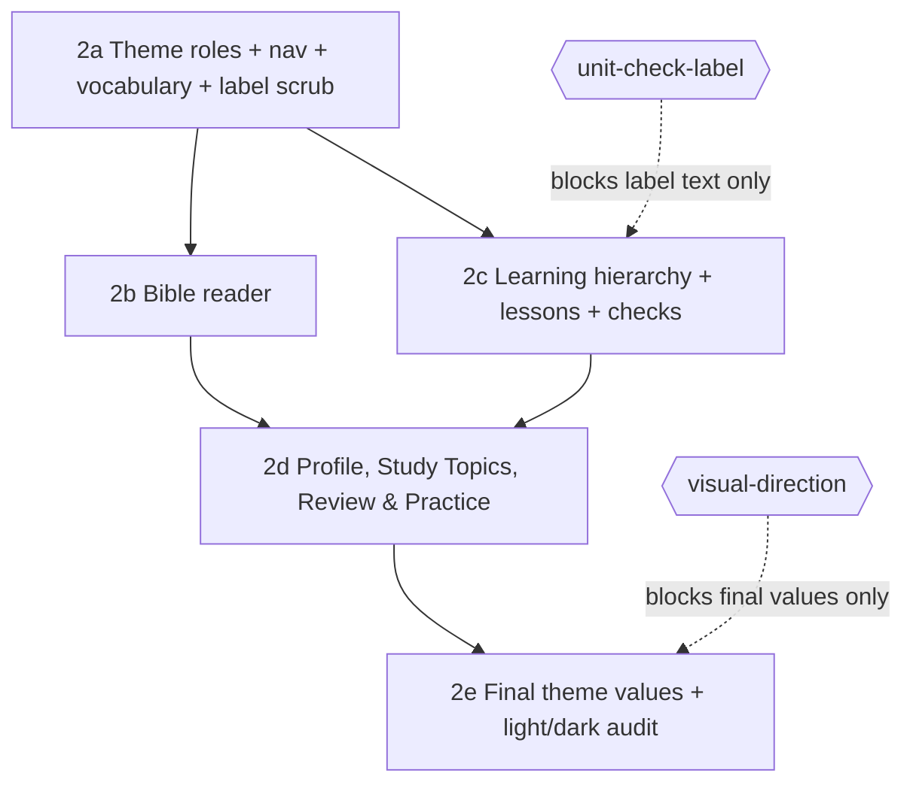

# Structural redesign plan — 2026-10-03

Approval record: `redesign.structure.brief-approved` (Chris, 2026-10-03). Phases: `2a`–`2e` under phase `2`.
This plan is the execution graph for that approval. **No slice executes until Chris approves this graph or edits it.**

## Scope

Correct navigation, page hierarchy, and presentation. Preserve the curriculum, Scripture, explanations, questions, answer logic, completion rules, and doctrinal content.

**Discovery vs. doing** is the organizing rule:
- The Shelf helps the learner choose a book, and the Bible reader helps them read it.
- The Learning Path helps them choose material, and the lesson helps them complete it.
- Working screens do not repeat full discovery controls.

### Preservation rule and its exclusions

Every piece of content and every capability that is reachable today stays reachable, except:

1. **Content removed by owner decision.**
   - All MCC and Disciples of Christ references (`curriculum.teaching-approach.identity`).
   - The Theologian Safety page. Only a short 988/911 line remains on About.
   - The 109 glossary terms removed under `curriculum.glossary.list`.
2. **Internal theology.** This covers the `theology.internal.*` records, the belief context, and the faith-interview material. It is never made learner-reachable or crawlable.

### Density is not content

Lesson content may be split across more, lighter cards, as long as nothing is cut, condensed, or summarized (`curriculum.rewrite.preservation`). Check *presentation* may be redesigned. Check *answer logic, scoring, and completion rules* may not.

## Vocabulary (decided)

| Thing | Learner-facing name | Stable ID / URL (unchanged) |
|---|---|---|
| Top level | Learning Path | `/course` |
| Level 2 | Module | `courseId` (e.g. `module.canon`) |
| Level 3 | Unit | `unitId` |
| Level 4 | Lesson | `lesson=` |
| Cumulative challenge (6) | Capstone | `course-N-capstone` |
| Per-unit scored activity | **open: `unit-check-label`** | `mastery=` |
| Home tab | Shelf | `/home` |
| Topics tab | Study Topics | `/topics` |
| Practice tab | Review & Practice | `/practice` |
| Profile | Profile | `/profile` |

IDs are never renamed (invariant). The canonical URLs above stay canonical. The aliases `/path`, `/study-topics`, and `/review` resolve to them, both client-side and through the SPA fallback.

## Graph

Each slice ships as one pull request. `bun run verify` and `node .roa-kit/roa.mjs verify` must pass, along with the slice's own acceptance checks, before the next slice starts.

## 2a — Theme roles, shared navigation, vocabulary, label scrub

Tasks:
1. **Theme-role migration.** Rewrite every hard-coded color, z-index literal, and `!important` onto the theme contract roles with no alias layer (`design.migration.route`). Current guard baseline: 192 `css-raw-color`, 25 `css-z-index-literal`, 36 `css-important`, and 4 `js-head-inject`. The baseline may only shrink, and the target is 0 for color and z-index.
2. **Tab bar.** The primary nav in `public/index.html` reads Shelf · Learning Path · Bible · Study Topics · Review & Practice. Update `aria-label`s, search labels, and orientation copy to match.
3. **Vocabulary pass.** Replace learner-facing "course" and "volume" copy with the decided names. Known sites:
   - `public/course-experience.js` landing lede ("set of N volumes")
   - `public/learning.js` activity-kind labels
   - `public/orientation.js`
   - the search placeholder

   Add a test that fails if those words appear for curriculum levels in rendered copy.
4. **Route aliases.** Add `/path`, `/study-topics`, and `/review` to the router and to the Worker SPA fallback.
5. **Label scrub.** Remove internal and system labels from learner view, such as raw source IDs in "not found" notices, sequence placeholders like `M`, and debug eyebrows. Add a test that fails on known internal-label patterns.
6. **Feedback CTA.** Assert that exactly one non-floating feedback CTA renders on every route (`feedback`).
7. **Theologian tab.** Assert that the right-edge folder tab renders on every route (`theologian.ui`).

Not in scope: the logo. It stays the placeholder mark until Chris chooses one (`ui.topbar`).

Accept when:
- Every route shows the new tab names, one feedback CTA, and the Theologian tab.
- The guard baseline shrinks.
- All existing deep links and the new aliases resolve.

## 2b — Bible reader

Tasks:
1. **Split into three views on existing parameters.**
   - Book discovery: `/bible` with `group`, `libraryq`, `view`.
   - Book overview: `/bible?book=`.
   - Passage reading: `/bible?book=&chapter=`, plus `start`, `end`, `focus`.
2. **Remove the Bible cover** from the reader (`ui.bible`).
3. **One passage toolbar** with a single primary action, chosen by state: Resume or Read.
4. **Rails (`ui.bible.rails`).** Left rail = links to study tools; right rail = the chosen tool's content plus notes, for the selected verse. Verses are selectable and highlightable.
5. **Make the Reading Desk optional and context-aware.**
   - Tabs with nothing to show are hidden.
   - Notes are visible: the Notes tab shows the selected verse's notes, with "Add a note to [verse]" when it has none (`notes.lesson-hidden` scopes hidden-by-default to lessons only).
   - Cross-references stay the last expandable level (`ui.bible.crossrefs`).
6. **Phase `1c` scope.** Resume, you-are-here, reading path, and ask-about-this-passage are delivered here. There is no "Ask" button in the passage toolbar: the Theologian tab opens already holding the current passage, or the selected verse, and the Reading Desk offers "Ask about [verse]" for the selected verse (`ui.bible.ask`).

Accept when:
- Check `r2-unaided-flow` passes: start, read, see where you are, follow a cross-reference, and return.
- All Scripture, metadata, notes, and cross-references remain reachable.

## 2c — Learning hierarchy, lessons, checks

Tasks:
1. **Each level shows only its own scope.** The Learning Path shows modules, a Module shows units, and a Unit shows lessons, its scored check, and any Capstone. Each level has its own labelled progress, one primary action (Start, Resume, or Review), and unchanged progress calculations.
2. **Lighter lesson cards.** Redistribute lesson content across more cards with step orientation from the existing progress dots (`ui.lesson.progress`). This is a word-for-word content diff, so nothing is lost.
3. **Context-aware Study Desk.**
   - It adapts to the current lesson step.
   - Empty tabs are hidden.
   - Lesson notes are hidden until opened (`notes.lesson-hidden`).
4. **Redesign check presentation** using the confirmed game set (`learning.games`): Rule Discovery, Sequence Repair, and the new memory game. Answer keys, scoring, and completion rules are untouched.
5. **Name the per-unit check** once `unit-check-label` is resolved.

Accept when:
- A content-diff script shows zero lost or altered lesson text.
- Every activity ID still completes.
- Check `r1-surfaces` passes for Learning Path, Module, Unit, and Lesson at 390px and 1920px.

## 2d — Profile, Study Topics, Review & Practice

Tasks:
1. **Profile** becomes a full screen (`ui.profile`) with Notes, Saved Passages, Learning Progress, and Preferences. Account behavior and stored data are unchanged.
2. **Study Topics** separates topic browsing, topic detail (`topic=`), and glossary lookup (`mode=`). The Reference Desk follows the 2b rules. Topics stay outside course completion (invariant).
3. **Review & Practice** separates scheduled review from optional practice, each with its own progress. Games, questions, scheduling, scoring, and achievements are unchanged. There are no streaks, leaderboards, or comparison (invariant).

Accept when:
- All existing practice modes and parameters still resolve.
- Check `r3-no-dead-ends` passes.

## 2e — Final theme values

Set the eight themes' role values per `design.themes.*` and the resolved `visual-direction`. Run the WCAG AA contrast rules for every theme in both modes, and confirm that layout is identical across themes (`design.themes.scope`).

Accept when:
- Contrast checks pass for all 16 theme and mode combinations.
- Check `r1-surfaces` passes in Reading Room (the default) plus two other themes.

## Open owner questions this plan touches

- `unit-check-label`: the name for the per-unit scored activity. This blocks label text in 2c only.
- `visual-direction`: this blocks final values in 2e only.
- `themes-three-questions` and `approve-glossary-review`: both appear resolved by later decisions and can be closed when convenient.
